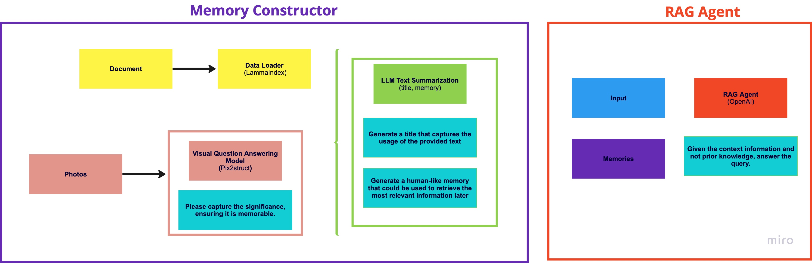

## Overview
Icarus is a retrieval-augmented generative agent executing multimodal user inputs on queryable, structured memory developed from unstructured text-based data lakes and photos.


## Get Started
```bash
poetry shell
python rag_openai.py
```

## Generate memory
```python
python visual_question_answering.py
```

## Rag
```python
python rag_openai.py
```

## Contributors
Christos Ziakas, Jaiden Reddy, and Vivek Vajipey